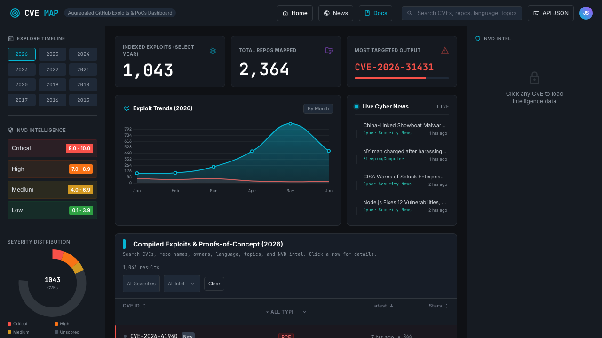

# CVE Map

Autonomous threat-intelligence dashboard that maps real-world GitHub CVE exploit PoCs to NVD/CISA intelligence and serves it as a static website.

[](https://yadavnikhil17102004.github.io/CVE-Intel/)
[](https://golang.org/)
[](https://nvd.nist.gov/)
[](https://github.com/features/actions)
[](https://github.com/yadavnikhil17102004/CVE-Intel/actions/workflows/ci.yml)



Live site:
- Dashboard: https://yadavnikhil17102004.github.io/CVE-Intel/
- News feed: https://yadavnikhil17102004.github.io/CVE-Intel/news.html
- Docs: https://yadavnikhil17102004.github.io/CVE-Intel/docs.html
- Contributor guide: [CONTRIBUTING.md](CONTRIBUTING.md)
- Product roadmap: [ROADMAP.md](ROADMAP.md)
- Ops log: [docs/operations/2026-08-14-stability-and-performance-log.md](docs/operations/2026-08-14-stability-and-performance-log.md)
- Workflow runbook: [docs/operations/workflow-triage-runbook.md](docs/operations/workflow-triage-runbook.md)

## Why CVE_Map?

- ✓ Aggregates CVE exploit intelligence from multiple sources
- ✓ Maps public exploit repositories automatically
- ✓ Provides searchable API endpoints and dashboards
- ✓ Tracks KEV and severity information for prioritization
- ✓ No account or setup required for browsing

## What it does

CVE Map continuously correlates:
- GitHub exploit/PoC repository activity
- NVD CVSS/CWE metadata
- CISA KEV exploitation status
- Hourly cybersecurity news signals

No backend. No database. No paid infra. Everything is static JSON + GitHub Pages.

## Quick start (local)

Requirements:
- Go 1.25+
- Python 3
- Optional: `NVD_API_KEY`, `SYNC_TOKEN`

Run local site:

```bash
./start.sh
# serves at http://localhost:8000
```

Run scrapers manually:

```bash
# CVE GitHub mapping
go build cvemapping.go
./cvemapping -github-token="$SYNC_TOKEN"

# NVD/CISA enrichment
go build nvd_scraper.go
./nvd_scraper -nvd-key="$NVD_API_KEY"

# Cybersecurity news feed
go build news_scraper.go
./news_scraper
```

Build sanity check:

```bash
go build cvemapping.go && go build nvd_scraper.go && go build news_scraper.go
```

## Key features

- Global CVE/PoC search across years
- Dashboard filters for:
  - Type (PoC / Exploit / General)
  - Severity (Critical / High / Medium / Low / Unscored)
  - KEV status (All / KEV only / Exclude KEV)
  - EPSS band (High / Medium+ / Low / Unknown)
- NVD side panel with CVSS, vector, CWE, source, KEV badge, EPSS (when available)
- Year timeline + trend charts + live activity feed
- Responsive news interface with tier filtering + keyword search
- Optimized frontend loading via year-scoped NVD intel files (`nvd_intel_YYYY.json`)

## Data endpoints

Base URL:
`https://yadavnikhil17102004.github.io/CVE-Intel/data/`

Core files:
- `YYYY.json` — CVE ↔ GitHub repo mappings for that year
- `nvd_intel_YYYY.json` — year-scoped compact NVD intel (frontend-optimized)
- `nvd_intel.json` — aggregate intel map (backward compatibility)
- `news.json` — hourly curated news feed

Example usage:

```bash
# CVEs for a year
curl -s https://yadavnikhil17102004.github.io/CVE-Intel/data/2026.json | jq '.cves[0]'

# Year-scoped NVD intel
curl -s https://yadavnikhil17102004.github.io/CVE-Intel/data/nvd_intel_2026.json | jq 'to_entries[0]'

# News feed
curl -s https://yadavnikhil17102004.github.io/CVE-Intel/data/news.json | jq '.articles[:3]'
```

## Demo dataset

A lightweight demo dataset is available for quick exploration without running scrapers:

- `sample-data/sample_cves.json`
- `sample-data/sample_news.json`
- `sample-data/sample_exploits.json`

Use these to test parsing logic, dashboard integration, or external pipelines.

## Architecture diagram

```text
GitHub Exploit Repos      NVD/CISA KEV         RSS Feeds
         |                    |                    |
         v                    v                    v
   +------------+      +--------------+      +------------+
   | cvemapping |      | nvd_scraper  |      | news_scraper|
   +------------+      +--------------+      +------------+
         \                  /                    /
          \                /                    /
           +-----------------------------------+
                       data/*.json
                           |
                           v
                  GitHub Pages (static CDN)
                    /        |         \
                   v         v          v
              dashboard   docs       news
```

## Automation (GitHub Actions)

- `.github/workflows/scrape.yml`
  - Runs every 6 hours
  - Builds + runs `cvemapping.go` and `nvd_scraper.go`
  - Commits updated `data/` JSON

- `.github/workflows/news.yml`
  - Runs hourly
  - Builds + runs `news_scraper.go`
  - Commits only `data/news.json`

Separated workflows reduce cross-job data races.

## Releases

This repository uses semantic version tags: `vMAJOR.MINOR.PATCH`.

Release flow:
1. Update the docs or data you want in the release.
2. Commit to `main`.
3. Create an annotated tag.
4. Push the tag and publish the GitHub Release from it.

Example:

```bash
git tag -a v1.1.0 -m "v1.1.0"
git push origin v1.1.0
```

Release notes template:

```md
## v1.1.0

### Added
- 

### Changed
- 

### Fixed
- 

### Notes
- 
```

Keep the release notes short and link back to the PRs or issues that were closed.

## Required secrets

Set in: `Settings -> Secrets and variables -> Actions`

- `SYNC_TOKEN` (required): GitHub token used by scraper workflow for authenticated API access
- `NVD_API_KEY` (recommended): faster NVD throughput and fewer rate-limit stalls

## Used by

- Independent security researchers
- Cybersecurity students
- Security enthusiasts and defenders

(If you are using CVE Map in your workflow, open an issue/PR and get listed.)

## Frontend performance notes

Recent optimization:
- `index.html` and `docs.html` fetch year-scoped intel files instead of loading the monolithic `nvd_intel.json` upfront.
- `dashboard.html` now precomputes per-CVE row metadata and uses O(1) detail lookup/cached intel fetch paths.

Result:
- lower initial payload
- faster first render for dashboard analytics

Benchmark harness:

```bash
node scripts/perf/dashboard-perf-compare.js
```

Policy: all future optimization claims must include before-vs-after measured stats from this harness (or an equivalent reproducible benchmark).

## Troubleshooting

- Empty/slow CVE updates:
  - verify `SYNC_TOKEN`
  - check GitHub API rate limits
- Sparse NVD enrichments:
  - add/validate `NVD_API_KEY`
  - NVD outages can delay fields temporarily
- Charts not rendering:
  - verify `data/*.json` exists and is valid JSON
  - open browser devtools console for fetch errors

## Ethics and intended use

This project is for defensive threat intelligence, prioritization, and security research.
Do not use it for unauthorized exploitation or illegal access.
